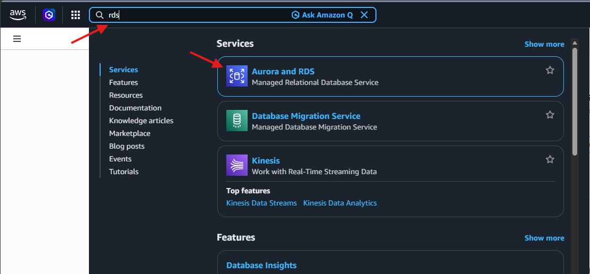
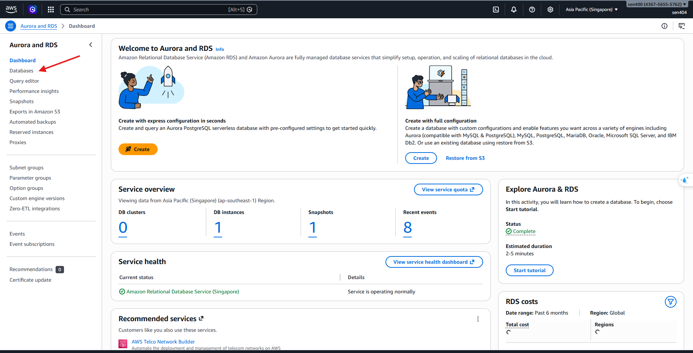
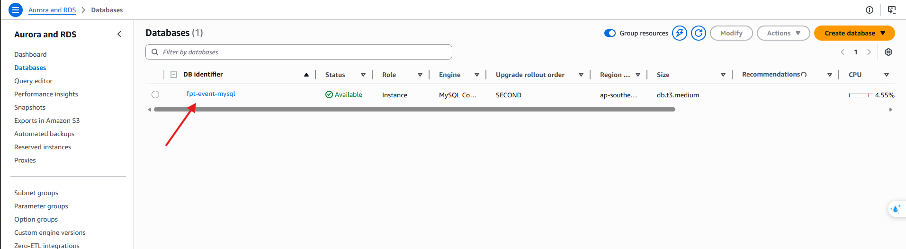
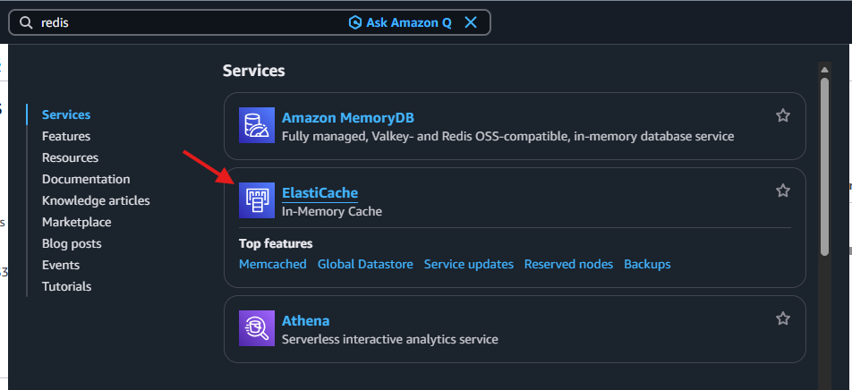
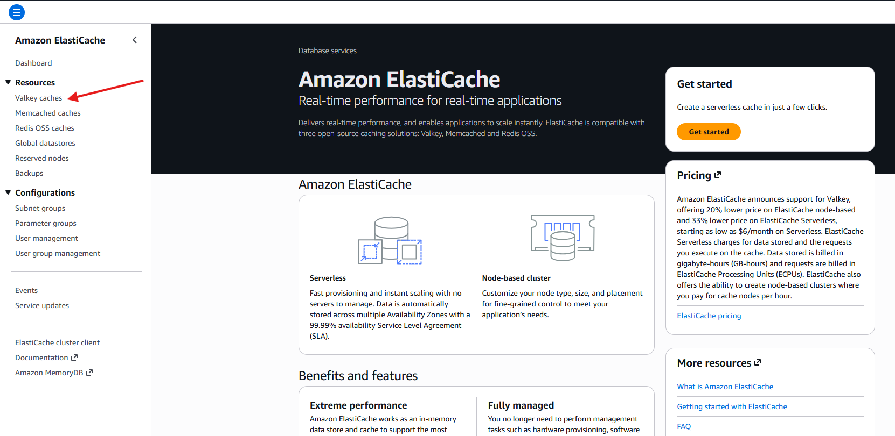
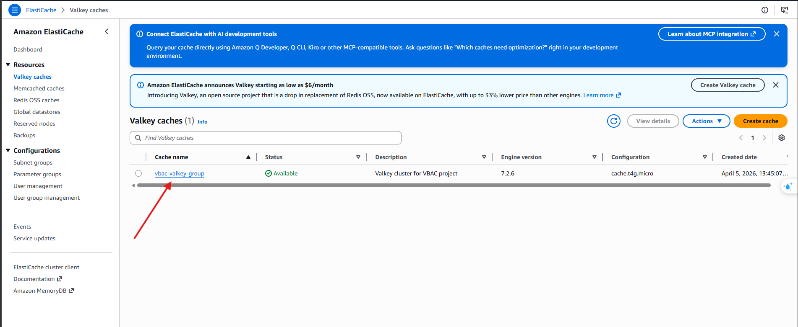
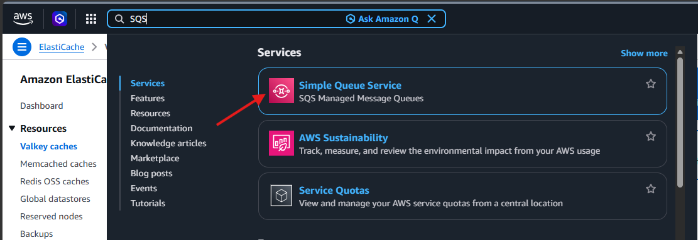
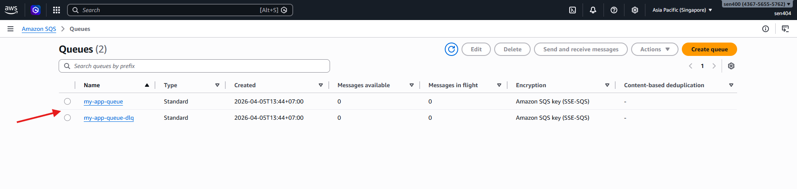

#### Verify Data and Queues

After the `terraform apply` command has completed successfully, all internal services are provisioned. In this step, we will verify the infrastructure on AWS:

1. **Amazon RDS (MySQL):** Check if the `auth`, `event`, `ticket` databases have been created successfully.
   - Access the AWS Console, enter **RDS** in the search bar, and select the **RDS** service.
   
   
   
   - Select **Databases** from the left-hand menu.
   
   
   
   - Confirm that the databases have been successfully created and are in the **Available** state.
   
   

2. **Amazon ElastiCache (Redis):** Verify the Redis endpoint and connectivity.
   - Enter **ElastiCache** in the search bar and select the **ElastiCache** service.
   
   
   
   - Select **Redis clusters** to view the list of your provisioned nodes.
   
   
   
   - Confirm that the Redis cluster is provisioned and shows an **Available** status.
   
   

3. **Amazon SQS:** Ensure your SQS queues are ready to receive events.
   - Enter **SQS** in the search bar and select **Simple Queue Service**.
   
   
   
   - Confirm that your SQS queues have been correctly listed in the console.
   
   