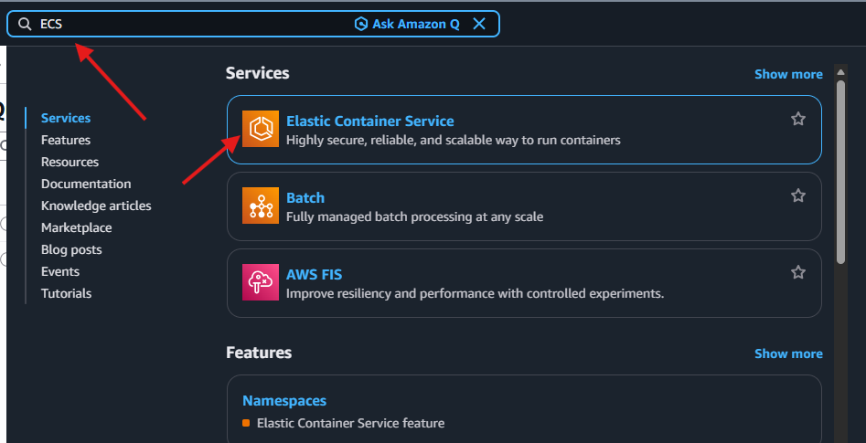
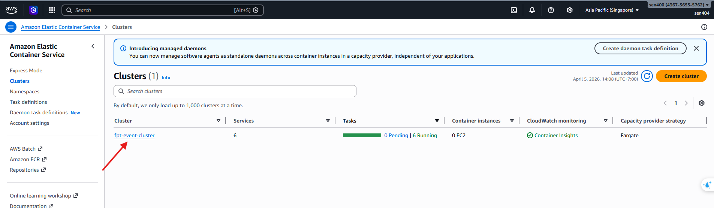
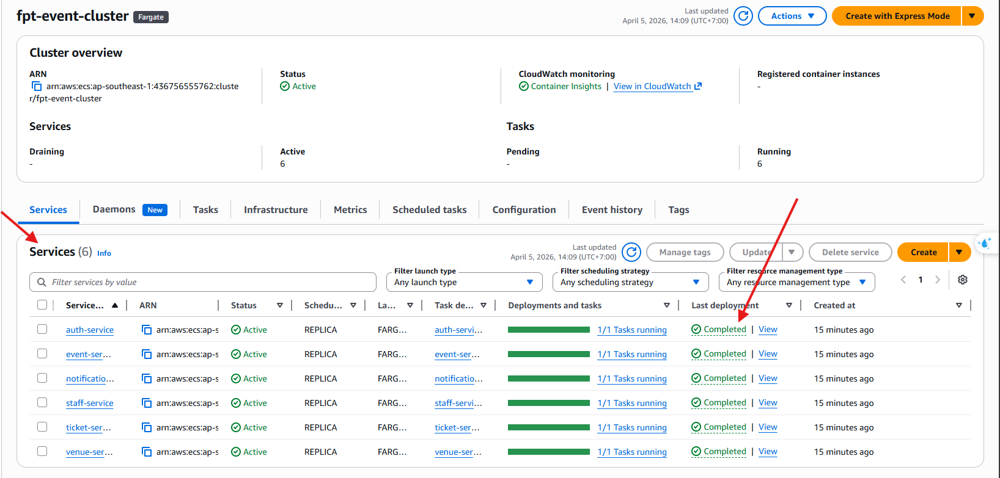
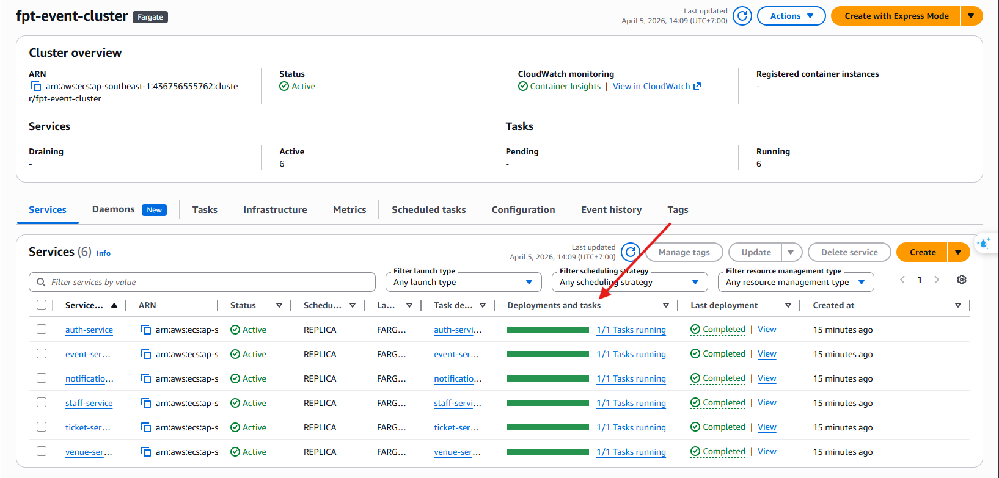
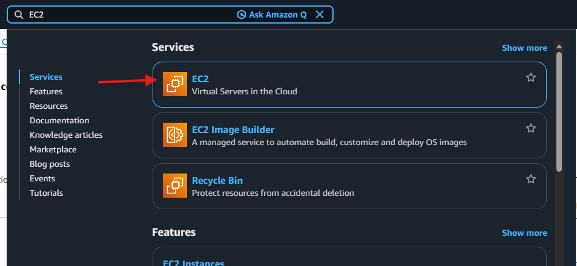
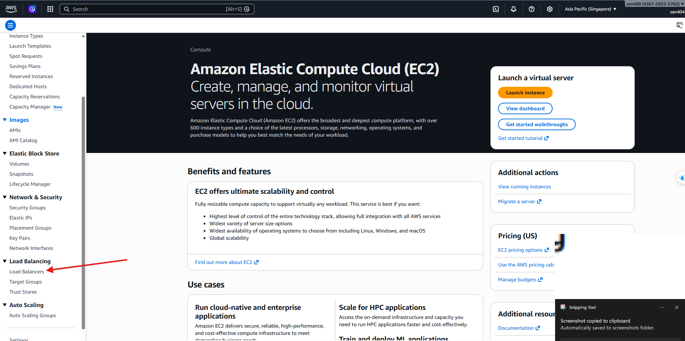
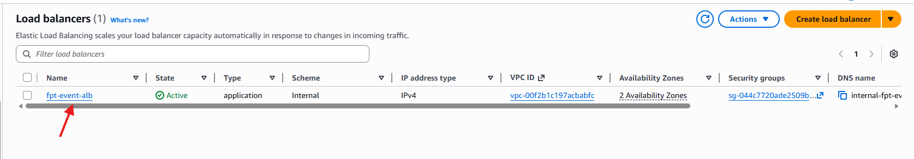
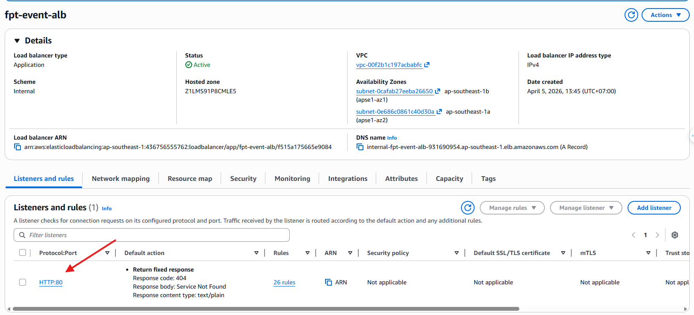
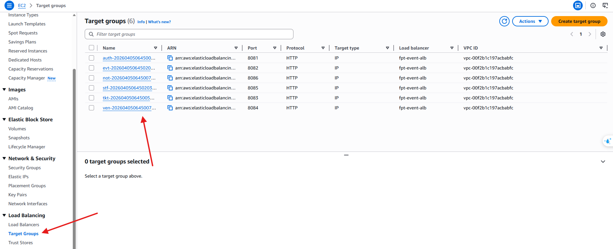

#### Verify ECS Services running on AWS Fargate

Our microservices are not publicly accessible over the internet but rather run in a private subnet, behind an internal Application Load Balancer (ALB).

1. **Verify ECS Clusters and Services Status:**
   - Access the **Amazon ECS Console** from the AWS search bar.
   
   
   
   - Select the deployed Cluster and navigate to the Services tab to see the list of backend instances (`auth-service`, `event-service`, `ticket-service`, `venue-service`, `notification-service`).
   
   
   
   - Ensure all services have been deployed successfully and show **Active** status.
   
   
   
   - Verify that the number of **Running Tasks** matches the desired configuration deployed by Terraform.
   
   

2. **Verify Target Groups on the Application Load Balancer:**
   - To verify container routing, go to the **EC2 Console**.
   
   
   
   - Scroll down the left menu to the **Load Balancing** section and select **Load Balancers**.
   
   
   
   - Click on the internal ALB provisioned for our system (e.g., `fpt-event-alb`).
   
   
   
   - Switch to the **Listeners and rules** tab to verify that the routing rules are configured correctly.
   
   
   
   - Next, go to **Target Groups** (located in the left menu under Load Balancers), select each group and ensure that the backend containers pass the Health Checks and report a **Healthy** status.
   
   
