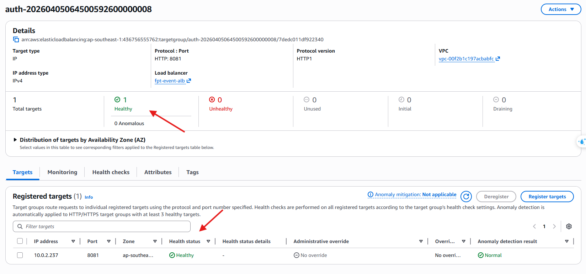

#### Xác minh các dịch vụ ECS chạy trên Fargate

Các microservices của hệ thống được lập trình ẩn ở vùng mạng riêng tư tư (private subnet) và giao tiếp thông qua Application Load Balancer (ALB) nội bộ, thay vì public trực tiếp ra Internet.

1. **Kiểm tra trạng thái ECS Clusters và Services:**
   - Truy cập **Amazon ECS Console** trên thanh tìm kiếm.
   
   
   
   - Chọn Cluster tương ứng và kiểm tra danh sách các dịch vụ (`auth-service`, `event-service`, `ticket-service`, `venue-service`, `notification-service`).
   
   
   
   - Đảm bảo rằng tất cả các service đều đang ở trạng thái triển khai thành công (**Active** / **Running**).
   
   
   
   - Đảm bảo số lượng **Running Tasks** khớp với yêu cầu hệ thống định sẵn.
   
   

2. **Kiểm tra Target Groups ở Application Load Balancer:**
   - Để kiểm tra khả năng định tuyến đến các container, vào giao diện **EC2 Console**.
   
   
   
   - Ở thanh menu bên trái, cuộn xuống phần **Load Balancing** và chọn **Load Balancers**.
   
   
   
   - Chọn ALB nội bộ của hệ thống (ví dụ: `fpt-event-alb`).
   
   
   
   - Qua tab **Listeners and rules** để kiểm tra các cấu hình định tuyến.
   
   
   
   - Truy cập phần **Target Groups** (ở thanh menu bên trái, phía dưới Load Balancers), xem từng Target Group và đảm bảo tất cả các container đều vượt qua Health Check (trạng thái **Healthy**).
   
   
    