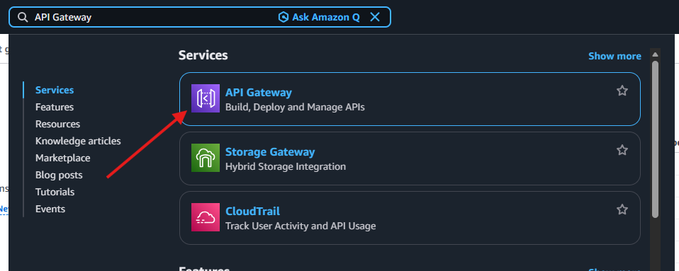
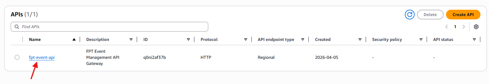
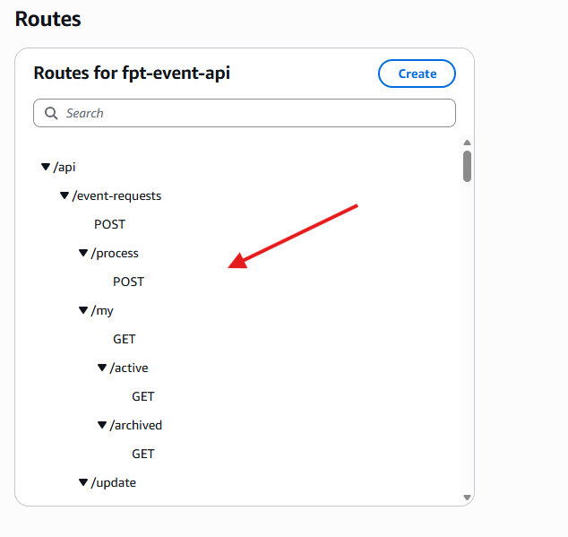
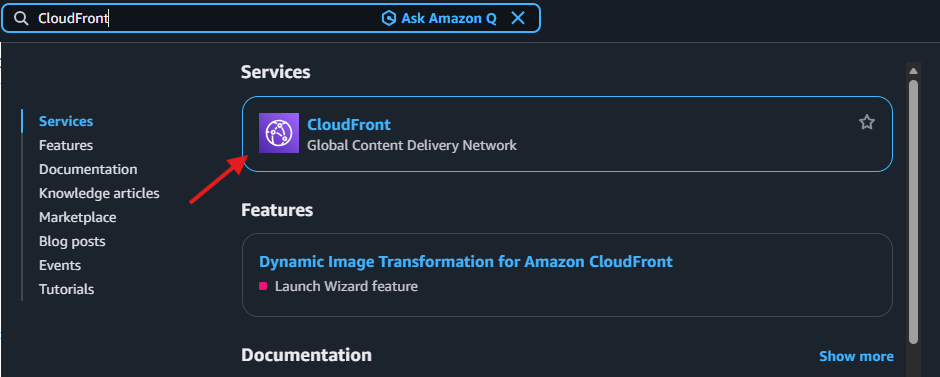
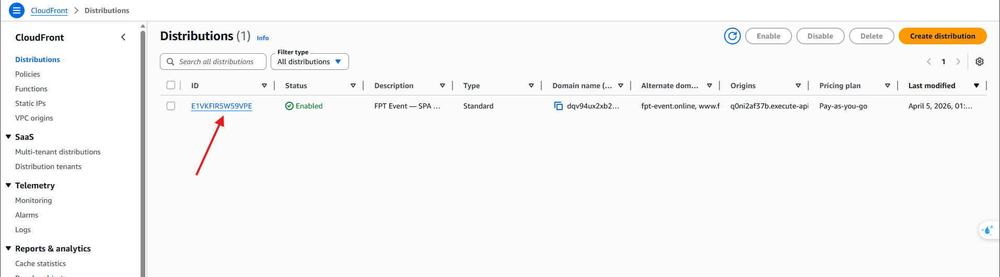
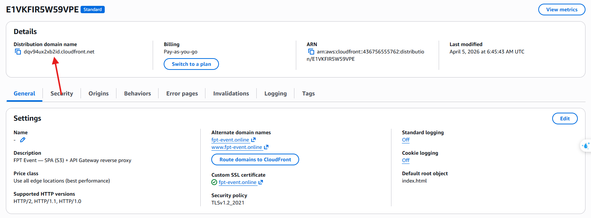
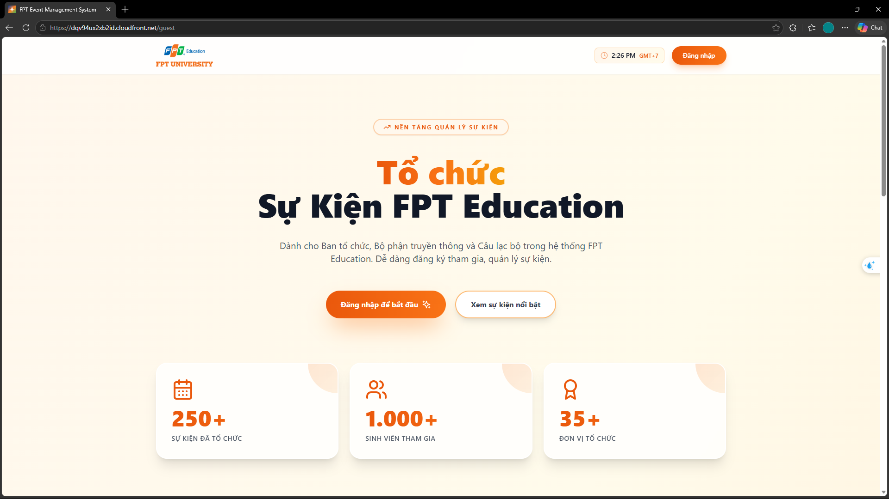
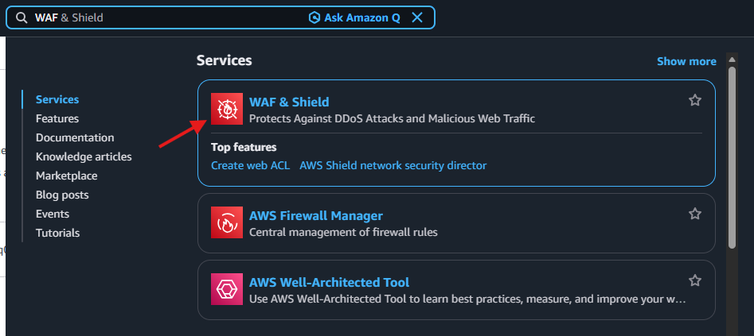
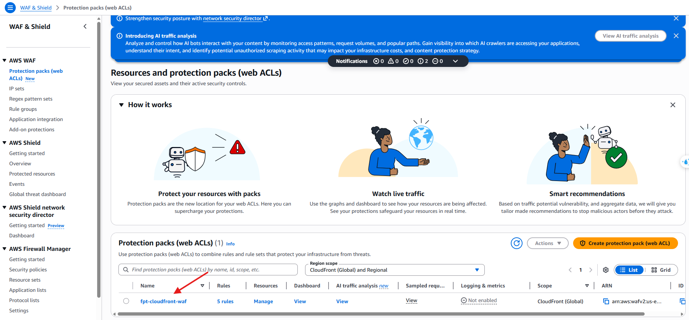

#### Verify User Interface and API Gateway

The final step is to check the Public Facing components that allow end users (those outside our VPC) to interact with the system.

1. **Verify Amazon API Gateway:**
   - Acting as our public gateway, we need to ensure its routes are correctly proxying traffic internally to the ALB.
   - Access **API Gateway** from the search bar.
   
   
   
   - Select the deployed API (e.g., `fpt-event-api`).
   
   
   
   - Verify that all necessary routes have been linked properly.
   
   

2. **Verify Amazon S3 & CloudFront:**
   - CloudFront serves the static React frontend hosted on S3. You can access the interface via the CloudFront Distribution URL.
   - Navigate to the **CloudFront** service.
   
   
   
   - Select the **Distributions** menu.
   
   
   
   - Copy the **Distribution domain name** and navigate to it in a browser window.
   
   
   
   - The ReactJS interface should load successfully if the deployment was successful.
   
   

3. **Verify AWS WAF (Web Application Firewall):**
   - Ensure the security rules are in place through WAF Web ACLs to prevent malicious attacks.
   - Navigate to **WAF & Shield**, select **Web ACLs**, and confirm that the firewall is attached to the CloudFront distribution.
   
   
   
   
