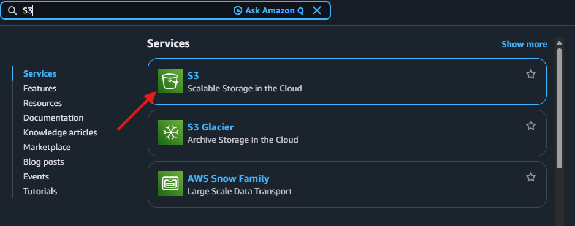
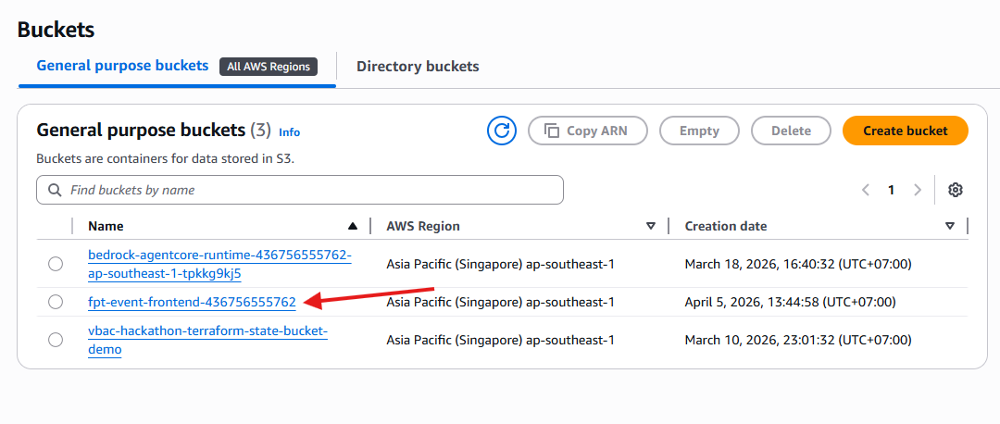
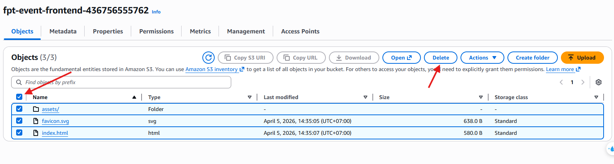
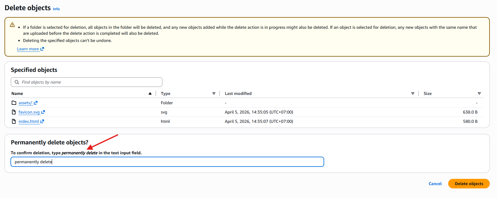

#### Dọn dẹp tài nguyên

Để tránh phát sinh chi phí hàng tháng sau khi kết thúc workshop, bạn cần thiết phải dọn dẹp không gian lưu trữ và xóa toàn bộ tài nguyên đã tạo.

**1. Làm rỗng Amazon S3 Bucket:**
Một số tài nguyên (ví dụ: các bucket S3 chứa tệp tĩnh) bắt buộc phải được làm rỗng thủ công thông qua giao diện AWS Console trước khi lệnh Terraform `destroy` có thể xóa hoàn toàn được bucket đó.

- Nhập **S3** vào thanh tìm kiếm và chọn dịch vụ **S3**.



- Chọn bucket của Frontend (ví dụ: `fpt-event-bucket`).



- Tích chọn bucket (hoặc các object bên trong) và nhấn nút **Delete**.



- Gõ cụm từ **permanently delete** (xóa vĩnh viễn) vào ô xác nhận hệ thống và thực hiện xóa.



**2. Hủy bỏ tài nguyên bằng Terraform:**
Về lại màn hình dòng lệnh (Terminal), chuyển đến thư mục `infrastructure` (nếu đang ở thư mục chứa mã nguồn Terraform) và tiến hành lệnh dọn dẹp các tài nguyên hạ tầng tự động:

```bash
terraform destroy --auto-approve
```
